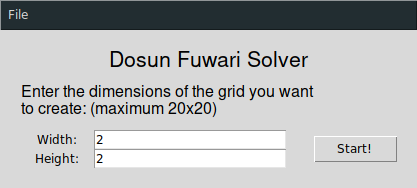
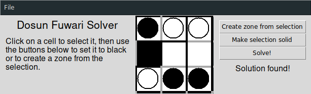

# Dosun Fuwari Solver

A python program that solves dosun fuwari grids for you.

## Dependencies

To run this program you'll need to install the following programs:
+ Python (≥3.6)
+ Tkinter
+ Pycosat

## The game

The objective of Dosun-Fuwari is to place balloons (white circles) and stones (black circles) in the grid according to the following rules:  
1. Place one balloon and one stone in each of the zones surrounded by bold lines.
2. Balloons are light and float, so they must be placed in one of the cells at the top, or in a cell right under a black cell (solid cell) or under other balloons.
3. Stones are heavy and sink, so they must be placed in one of the cells at the bottom, or in a cell right over a black cell or over other stones.

This program allows you to enter a grid and generate a solution.


## Usage
+ Command line :

Creation of SAT clauses: python3 json-2-sat.py <grid.json>, this creates in the directory where the grid is a .cnf

Creation of 3-SAT clauses: python3 json-2-3sat.py <grid.json>, this creates in the directory where the grid is a .cnf

Solving a grid with picosat: picosat <grid.cnf> --all | python3 display_sat_results.py picosat <grid.json>

Solving a grid with minisat: minisat <grid.cnf> tmp.txt AND python3 display_sat_results.py minisat <grid.json> tmp.txt

+ Graphical interface :

To run the program (after having installed the dependencies), simply run  
```sh
python3 main.py
```

You'll see the following screen:  
  
This is the *start screen*. Here  you can specify the dimensions of the grid you want to initialize, or you can open and existing grid from the *file* menu.

Lets assume you've initialized an empty grid of dimensions 3x3 and clicked the *Start!* button. You should see something like this:  
  
On the left you have a brief help text, in the middle the grid itself, and to the right the action list.  
To select a cell, left-click on it with your mouse. Selected cells are highlighted in blue:  
  
To deselect a cell, left-click on it again. Only cells that share a border can be selected simultaeously: if you select a cell that doesn't share a border with a currently selected cell, the previous selection will be lost.

Selected cells can be turned into a zone (see rule #1) by clicking the *Create zone from selection* button to the right of the grid. The selection can also be toggled solid (black) or empty (white) by clicking the *Make selection solid* button. Here is a grid that's been filled with three zones and a solid cell:  
  
Please note that solid cells can't be contained in a zone.

Once you have entered your grid, click the *Solve!* button in order to get the program to solve the grid. If a solution is found, the text *Solution found!* will appear beneath the *Solve!* button and the solution will be overlayed on top of the grid. If a solution can't be found, the text *No solution found!* will appear instead:  
| Satisfiable grid | Unsatisfiable grid |
|:----------------:|:------------------:|
|  |  |

The *File* menu offers several useful options:
+ **New grid** returns you to the *start screen*, allowing you to initialize a new grid.
+ **Open grid** allows you to open an existing grid stored on your disk. Grids are stored as plain text JSON files.
+ **Save grid** allows you to save your grid to a JSON file for future use.
+ **Export DIMACS SAT** allows you to export the cnf file describing the satisfiability of your grid. This allows you to solve your grid using a standalone satsolver.
+ **Export DIMACS 3SAT** does the same as the above, except it exports the reduced 3-SAT version of the satisfiability formula.

## Program structure

+ `main.py`: Main program. Run this file to run the graphical interface.
+ `display_sat_results.py`: Commandline utility script that displays the output of a satsolver as a grid (text). Currently supports minisat and picosat output files.
+ `json-2-sat.py`: Commandline utility script that generates the DIMACS .cnf file that describes the satifiability of a given grid.
+ `json-2-3sat.py`: Same as above, but reduces the satisfiability clauses to 3-SAT.
+ `lib/grid.py`: contains the Grid class.
+ `lib/gen_formule.py`: contains the functions that generate the cnf formula that's passed to the satsolver.
+ `lib/file_io.py`: contains the functions used to import/export files in and out of the program.

## Authors
+ [Dylan ROBINS](https://github.com/dylan-robins/)
+ Lucas DREZET
+ Louis WADBLED

## License

This project is licensed under the MIT License - see the [LICENSE](LICENSE) file for details
