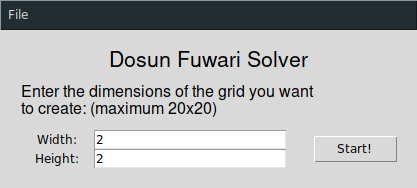
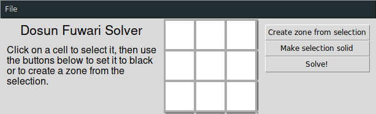
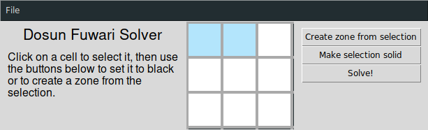
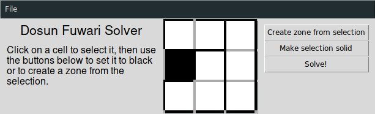
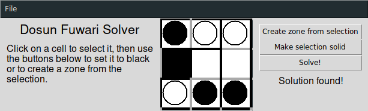
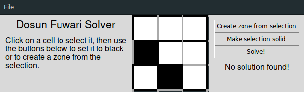

# Dosun Fuwari Solver

Un programme en python qui résout des grilles de Dosun Fuwari pour vous.

## Dependances

Pour faire fonctionner ce programme, vous allez avoir besoin de :
- Python(Version supérieure à 3.6)
- Tkinter
- Pycosat

## Le jeu

L'objectif du Dosun Fuwari est de placer des ballons (cercles blancs) et des pierres (cercles noirs) dans une grille suivant les règles suivantes :
1. Placer un ballon et une pierre dans chaque zone entourée par des lignes en gras.
2. Les ballons sont légers et flottent, ils doivent donc être placés dans une cellule du haut, ou dans une cellule juste en dessous d'une cellule noire (cellule solide) ou en dessous d'un autre ballon.
3. Les pierres sont solides et coulent, elles doivent alores être placées dans une cellule du bas, ou dans une cellule au dessus d'une cellule noire ou encore au dessus d'une autre pierre.

Ce programme permet d'entrer une grille et de générer une solution

## Utilisation
+ Ligne de commande :

  + Création des clauses SAT : 
python3 json-2-sat.py <grille.json>, cela créé dans le repértoire où est la grille un .cnf
  
++ Création des clauses 3-SAT : 
python3 json-2-3sat.py <grille.json>, cela créé dans le repértoire où est la grille un .cnf
  
++ Résoudre une grille avec picosat : 
picosat <grille.cnf> --all | python3 display_sat_results.py picosat <grille.json>

++ Résoudre une grille avec minisat : 
minisat <grille.cnf> tmp.txt
python3 display_sat_results.py minisat <grille.json> tmp.txt

+ Interface graphique :

Pour faire fonctionner le programme (après avoir installé les dépendances), il suffit d'utiliser la commande :
```sh
python3 main.py
```

Vous allez voir la fenêtre suivante :  
  
C'est la fenêtre de départ. Vous pouvez y spécifier les dimensions de la grille que vous voulez initialiser, ou vous pouvez ouvrir une grille existante depuis le menu "file".

Supposons que vous avez initialisé une grille vide de dimensions 3x3 et cliqué sur le bouton "Start!". Vous devriez voir apparaitre ceci :  
  
Sur la gauche vous avez un petit texte d'aide, au centre il y a la grille et sur la droite la liste des actions.  
Pour selectionner une cellule, il suffit de cliquer dessus avec la souris. Les cellules selectionnées sont surlignées en bleu:  
  
Pour déselectionner une cellule, un clic gauche suffit. Seules les cellules côtes à côtes peuvent être sélectionnées simultanément : si vous sélectionnez une cellule qui ne partage pas une bordure avec une cellule déjà selectionnée, la selection précédente sera perdue.

Les cellules sélectionnées peuvent être transformées en une zone (voir règle 1) en cliquand sur le bouton "Create zone from selection" à droite de la grille. Cette selection peut également devenir solide (noir) ou vide (blanc) en cliquant sur "Make selection solid".  
Voici une grille composée de 3 zones et une cellule solide :  
  
Veuillez noter qu'une cellule solide ne peut pas être dans une zone.

Une fois que vous avez entré la grille, cliquez sur "Solve!" pour utiliser le programme qui résout la grille. Si une solution est trouvée, le texte "Solution found!" va apparaitre en dessous du bouton "Solve!" et la solution sera supperposée sur la grille. Si aucune solution ne peut être trouvée, le texte "No solution found!" apparaitra.

Grille satisfaisable :  


Grille insatisfaisable :  


Le menu "File" offre différentes options :
- **New grid** renvoie à l'écran de départ permettant d'initialiser une nouvelle grille
- **Open grid** permet d'ouvrir une grille existante enregistrée sur votre ordinateur. Les grilles sont enregistrées au format JSON.
- **Save grid** permet de sauvegarder une grille en un fichier JSON.
- **Export DIMACS SAT** permet d'exporter un fichier cnf décrivant la satisfaisabilité de votre grille. Cela permet de résoudre votre grille en utilisant un satsolver autonome.
- **Export DIMACS 3SAT** fait la même chose que précedemment, à la seule exception près que cela exporte la version 3-SAT réduite de la formule de satisfaisabilité.

## Structure du programme
- `main.py`: Programme principal. Executez ce fichier pour lancer l'interface graphique
- `display_sat_results.py`: Outil de ligne de commande qui affiche le résultat d'un satsolver sous forme de grille résolue de Dosun-Fuwari. Prend en charge les sorties de minisat et de picosat.
- `json-2-sat.py`: Outil de ligne de commande qui génère le fichier .cnf au format DIMACS décrivant la satisfaisabilité d'une grille donnée en argument.
- `json-2-3sat.py`: Pareil que ci-dessus, mais réduit les clauses de satisfaisabilité en des clauses 3-SAT.
- `lib/grid.py` : contient la classe de la grille.
- `lib/gen_formule.py` : contient les fonctions qui générent la formule cnf qui est donnée au satsolver.
- `lib/file_io.py`: : contient les fonctions utilisée pour importer/exporter les fichiers dans/en dehors du programme.

## Auteurs
Dylan ROBINS
Lucas DREZET
Louis WADBLED

## Licence
Ce projet est sous licence MIT - voir le fichier LICENCE pour plus de détails. 
